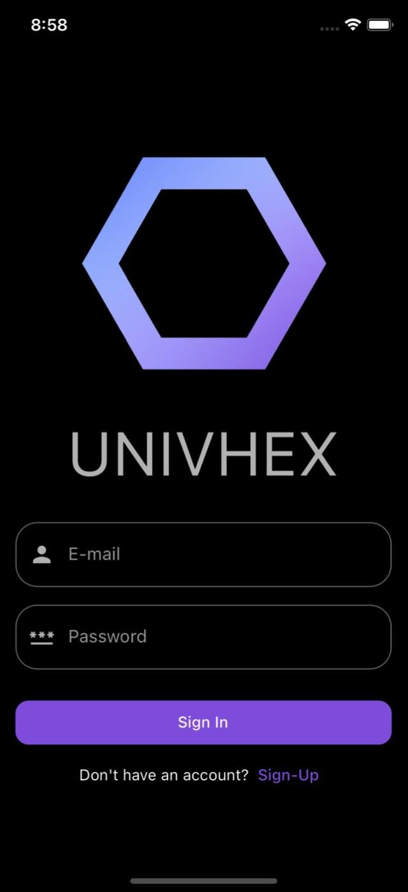
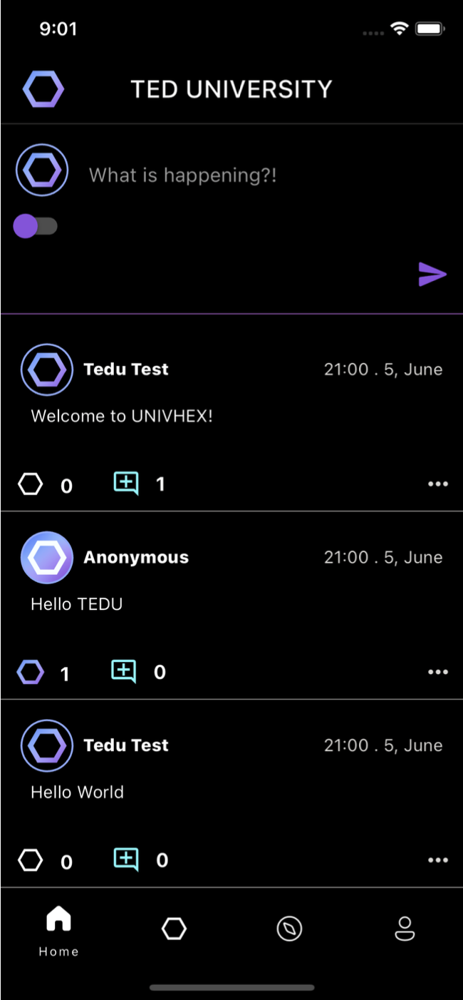
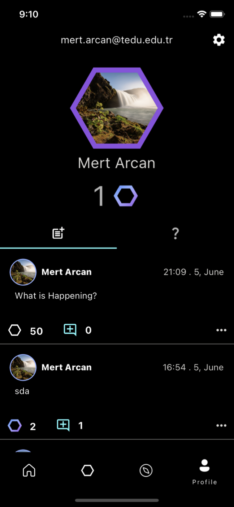
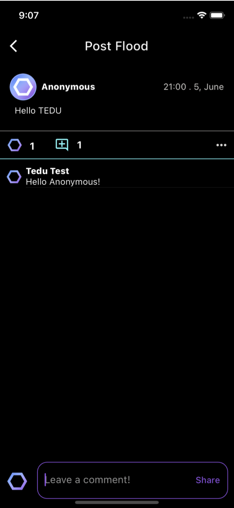

# Univhex

Univhex is a social media platform designed exclusively for university students, promoting interaction and engagement within campus communities. Users can register with their university email to ensure a secure and student-only environment, where they can share posts anonymously or with their identity, follow campus-related content, and interact with others. Developed as a senior project, Univhex aims to bridge social connections among students, providing a platform for interaction that resembles traditional social media applications but with a focus on campus life.

## Features

- **Verified Student Community**: Users register using their university email, ensuring a campus-only network.
- **Post Sharing and Interaction**: Students can share posts, comment, like (hex), and engage with content from their university.
- **Anonymous Posting Option**: Allows users to share thoughts without revealing their identity.
- **User-Friendly Design**: Intuitive navigation through profile, home, and interaction pages tailored for a smooth user experience.
- **Security and Privacy**: Ensures user data protection with Firebase, guarding against unauthorized access.

## Technologies Used

- **Flutter**: Used as the main framework for cross-platform mobile development, enabling deployment on both iOS and Android.
- **Dart**: The primary programming language used for building app functionalities.
- **Firebase**: Utilized for backend services, including authentication, database management, and storage.

## Getting Started

1. **Clone the Repository:**

   ```bash
   git clone https://github.com/Arjein/Univhex.git
   ```

2. **Navigate to the Project Directory:**

   ```bash
   cd Univhex
   ```

3. **Install Dependencies:**

   ```bash
   flutter pub get
   ```

4. **Run the Application:**

   ```bash
   flutter run
   ```

## Screenshots

<div align="center">

| Login Screen | Post Flood Screen |
|:-------------------------:|:-------------------------:|
|  |  |

| Profile Screen | Comment Section |
|:-------------------------:|:-------------------------:|
|  |  |

</div>


## License

This project is licensed under the MIT License. For more details, refer to the [LICENSE](https://github.com/Arjein/Univhex/blob/main/LICENSE) file.


